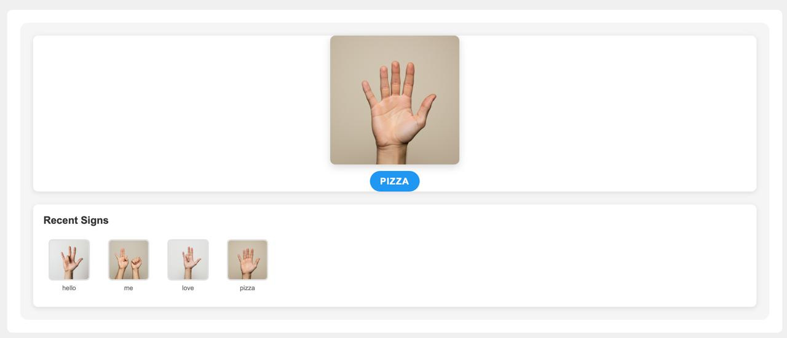

# SignScribe

## 1. What is this?

SignScribe is an AI solution that provides real time sign language translation. It allows deaf people (5% of global population) to follow live events and content online by generating sign language images in real time.

## 2. [Video Demonstration]((https://www.loom.com/share/4d197882589549b2a23de2cc63edb7b8?sid=eaa61568-a34e-46ab-b20c-e4086055d7ab))

## 3. Gemini models and Pipecat

Firstly we used Pipecat to orchestrate the entire pipeline, which is structured as follows:

1. Pipecat listens to the audio of the person speaking and, using the Cloud Speech-to-Text API on Google, transcribes the audio to text.
2. The transcribed text is then passed to the Gemini to translate the text into ASL grammar.
3. The ASL grammar is then passed to the Gemini Image Generation API to generate the sign language images.
4. The sign language images are then passed to the Pipecat pipeline to be displayed to the user.

## 4. Tools used

1. Pipecat
2. Gemini
   - Cloud Speech-to-Text API
   - Generative Language API

## 5. What we did new during the hackathon

We started on this project from scratch. We got the idea on our way to the hackathon this morning so all code was written today. Both technologies are new to us so we had to learn them on the fly!

## 6. Feedback

First time using GCP it took a bit to get everything set up.